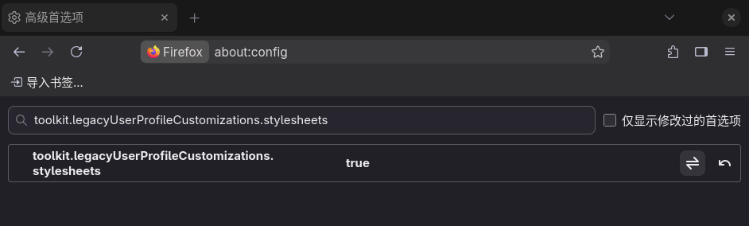
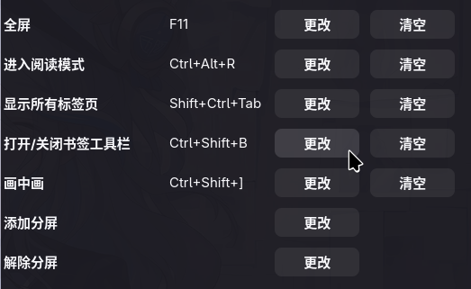

### 🔧 第一步：启用 CSS 自定义功能
1. 在 Firefox 地址栏输入 **`about:config`** 并回车。
2. 如果出现安全提醒，点击“**接受风险并继续**”。
3. 在顶部的搜索框里输入 **`toolkit.legacyUserProfileCustomizations.stylesheets`**。
4. 点击这一项最右侧的**双箭头切换按钮**，将它的值从 `false` 改为 **`true`**。这样 Firefox 就会在启动时加载我们自定义的 CSS 文件了。


### 📁 第二步：创建 CSS 配置文件
1. **找到配置文件夹**：在地址栏输入 **`about:support`** 并回车。点击“**配置文件文件夹**”右侧的“**打开文件夹**”按钮。
2. **创建 `chrome` 文件夹**：在打开的文件夹里，**新建一个文件夹**，并将其命名为 **`chrome`**（注意：全部小写）。
3. **创建 CSS 文件**：进入 `chrome` 文件夹，在里面新建一个纯文本文件（例如 `.txt` 文件），然后将其**完整地重命名**为 **`userChrome.css`**（注意：文件扩展名必须是 `.css` 而不是 `.txt`）。

### ✍️ 第三步：添加 CSS 代码
用记事本或代码编辑器打开刚才创建的 `userChrome.css` 文件，将下面的代码粘贴进去并保存。

```css
/* 当书签工具栏隐藏时，隐藏标签栏 */
#navigator-toolbox:has(#PersonalToolbar[collapsed=""]) #TabsToolbar {
    visibility: collapse !important;
}

/* 书签栏隐藏时，透明隐藏工具栏，保留布局空间保证弹窗定位，负 margin 收回空间 */
#navigator-toolbox:has(#PersonalToolbar[collapsed=""]) #nav-bar {
    visibility: hidden !important;
    margin-bottom: -42px !important;
}
```


### 🔄 第四步：保存并重启 Firefox
完全关闭所有 Firefox 窗口，然后重新打开浏览器，配置就生效了。按`Control+Shift+B`开关书签栏，此时工具栏和标签栏会跟着显示或隐藏。


### 修改快捷键
在 Firefox 地址栏输入 **`about:keyboard`** 并回车。  
默认开关书签栏的快捷键为`Ctrl+Shift+B`，可根据自己习惯修改快捷键。  

**如果想让界面恢复原样**：只需要再次打开配置文件夹，将 `chrome` 文件夹**重命名**为其他名字（比如 `chrome_backup`），或者直接**删除**它，然后重启 Firefox 即可。